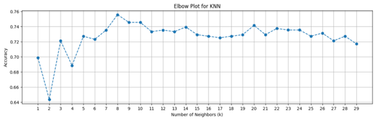

# Project 4: Finance Loan Approval Prediction

## Presented by Group 4
* Brent Beachtel
* Justin Bein
* Tico Brown
* Jim Haugen
* Celina Kamler
* Nataliia Shevchenko

## Project Structure

### Directory Overview

├── Resources
│   ├── raw_data           # Raw data files
│   └── cleaned_data       # Cleaned data files
├── Screenshots            # Screenshots related to the project
├── model_development
│   ├── final_notebook.ipynb   # Consolidated research notebook downloaded from Google Colab
│   └── individual_notebooks   # Individual notebooks used in the final notebook
├── static
│   └── css
│       └── styles.css     # CSS styles for the web application (app.py)
├── tableau
│   ├── analysis.twbx      # Tableau analysis file
│   └── analysis.html      # Exported Tableau analysis in HTML format for display in the app
├── templates
│   ├── index.html         # Main webpage template
│   └── tableau.html       # Tableau analysis webpage template
├── training
│   ├── train_model.py     # Script for training the final model (neural network)
│   └── final_model.h5     # Saved final model file
└── app.py                 # Main flask application

### How to Run
Enter "python app.py" or "python3 app.py" from the terminal.  This will launch the Flask web application and/or provide you with a link (e.g., http://127.0.0.1:5000) where you can view the main webpage with applicant interface and Tableau analysis.

## Analysis Overview

### Purpose 
The purpose of this analysis is to develop a machine learning model capable of predicting loan approval of applicant(s) seeking a mortgage.  By leveraging machine learning and the models employed in machine learning, the goal is to create a binary classifier that can determine whether applicants will be successful in receiving a loan. This model aims to help loan providers to make data-driven decisions in selecting applicants, thereby providing one source for predicting the approval of mortgage applicants. 

### Data Preprocessing
Referring to the file entitled "Finance_loan_approval_prediction_data_collab.ipynb" found in "ML_test" folder of the main branch, the original data was provided in a .csv.  It was read into a Pandas DataFrame and found to comprise 614 rows of data representative of previous mortgage applicants comprised of the following features:
- **Loan_ID:** Unique identifier for each row. 
- **gender:** Gender of the applicant.
- **Dependents:** Number of dependents of the applicant.
- **Education:** College or non-college education of the applicant.
- **Self_Employed:** Whether or not the applicant was self-employed (Y/N).
- **ApplicantIncome:** Income of the applicant.
- **CoapplicantIncome:** Income of a co-applicant (if present).
- **LoanAmount:** Loan amount of the mortgage requested by the applicant (in thousands).
- **Loan_Amount_Term:** Number of months for the term of the mortgage (in months).
- **Credit_History:** Whether or not the applicant had any prior credit history (Y/N).
- **Property_Area:** Area of the property to which mortgage will be applied, i.e., Urban/Rural/Semiurban.
- **Loan_Status:** Approval or non-approval of the mortgage for the applicant, i.e., Y-Yes, N-No.

After examination of the data, the following actions were performed:
- Loan_ID: was dropped.
- Loan_Status: Data type 'N' and 'Y' were transformed to '0' and '1', respectively.    
- The data was split into a train subset (80%) and a test subset (20%); the random state for reproducibility was set at 1.
- Categorical columns were defined: gender, Married, Dependents, Education, Self_Employed, and Property_Area.
- Numerical columns were defined: ApplicantIncome, CoapplicantIncome, LoanAmount, LoanAmountTerm, CreditHistory, and Loan_status.
- Missing values of the numerical columns of the train and test subsets were imputed with an imputer value defined by 5 neighbors.
- Categorical columns of the train and test subsets were converted into dummy/indicator variables.
- Loan_Status was considered "label" (y) because it is data which will indicate approval of the mortage applicant.
- All variables except Loan_Status were considered "features" (X) they are the data used to predict the approval of the mortage applicant.
- Test and train subsets were divided into the following:
  - First train and test subsets (i.e., y_train and y_test) comprising the "label" column were created .
  - Second train and test subsets (i.e., X_train and X_test) comprising the "features" columns were created.

### Logistic Regression Models
**First Logistic Regression Model:**
- A logistic regression model comprising reproducibility random state of 1 was created and fitted as a function of X_train and y_test data.
- Prediction data (i.e. y_pred) was created as a function of X_test data.
- A confusion matrix is a useful tool for evaluating the performance of a classification model. The matrix provides information about true positives (TPs), true negatives (TNs), false positives (FPs), and false negatives (FNs).  The following Confusion Matrix of this logistic regression model was generated as a function of the y_test and y_pred data:

- A classification report is commonly used to evaluate the performance of a classification model in terms of precision, recall, F1-score, and support. The following Classfication Report of this logistic regression model was generated as a function of the y_test and y_pred data:

**Second Logistic Regression Model:**

- Polynomial features are employed so the model could be trained better on a relatively large set of features.  Here, polynomical features (i.e., X_train_poly, X_test_poly) were created and fitted as a function of X_train and X_test.  
- A second logistic regression model was created and fitted with X_train_poly and y_train data.
- Prediction data (i.e., y_pred) was re-created as a function of X_test_poly data.
- The following Classfication Report of the second logistic regression model was generated as a function of the y_test and y_pred data:

**Conclusion** 
The first logistic regression model reveals a high precision for the positive class (0.78) and a high recall (0.98); the second model shows a decrease in precision (0.71) but an improvement in recall (0.51) for the negative class. The overall accuracy of the first model is 80%, while the second model's accuracy is 78%. Based on this analysis, the polynomial features and L1 regularization included in the second model did not significantly improve the model's performance and even reduced its precision in some cases. 

###  Neural Network (NN) Models 
**First NN Model**
- A first NN model of a sequential NN model comprising two hidden layers and one output layer was created.
- The first hidden layer was added for receiving the input data of the features in the X_train data and comprised of 64 neurons and a ReLU activation function.
- A regularization technique for preventing overfitting of the model was added so that 50% of the neutrons were randomly dropped out (i.e., set to zero) to preventing co-adaptation of neurons and encourage the model to learn more robust features.
- The second hidden layer comprised of 10 neurons and a ReLU activation function was added. 
- The regularization technique was applied.
- The output layer comprised of 1 fully-connected neuron and a sigmoid activation function was added for squashing the output between 0 and 1. 
- The following presents the structure of the NN model:
    

**Second NN Model**
- A second NN model was complied.
- A loss function of cross-entropy was employed. In binary classification tasks, it is commonly employed to measure the difference between predicted and actual labels.
- An adaptive learning rate optimization algorithm was employed to determine how the model's weights are updated during training.
- The evaluation metric of accuracy was employed to measure how well the model predicted the correct class by representing the prorortion of correctly predicted samples.
- X_train and X_test were amended as a function of a scaling processing technique (i.e., StandardScaler()) so that the features were standardized. StandardScaler() contributes to the robustness, interpretability, and performance of machine learning models trained on diverse datasets.
- The second NN model was fitted as a function of X_train, y_train and 100 epochs, where the weights of the model are adjusted to minimize the loss function during each epoch.  
- The following presents the model's loss and accuracy as a function of X_test and y_test:  

**Third NN Model**
- A third NN model of a second sequential NN model comprising two hidden layers and one output layer was created.
- The first hidden layer was added for receiving the input data corresponding to the X_train features and comprised of 64 neurons and a ReLU activation function.
- The regularization technique discussed above was applied.
- The second hidden layer comprised of 32 neurons and a ReLU activation function was added. 
- The regularization technique was applied.
- The output hidden layer comprised of 1 fully-connected neuron and a sigmoid activation function was added. 
- The model was compiled using the Adam optimizer, binary_crossentropy loss function, and the evaluation metric of accuracy (discussed above). The Adam optimizer is an adaptive learning rate optimization algorithm for adjusting the learning rate during training to improve convergence speed and performance. The binary_crossentropy loss function measures the difference between predicted probabilities and actual class labels.
- The third NN model was fitted as a function of X_train, y_train, 50 epochs, 32 samples used per iteration, and a 20% proportion of training data to use for validation during fitting.  
- The third NN model delivered an accuracy of 0.80.

**Fourth NN Model**
- A fourth NN model of a third sequential NN model comprising four hidden layers and one output layer was created.
- The first hidden layer was added for receiving the input data corresponding to the X_train features and comprised of 256 neurons, a ReLU activation function, and L2 regularization having a coefficient of 0.001 being applied to the layer’s weights.
- A normalization technique was applied to improve convergence and generalization by ensuring that the mean activation is close to zero and the standard deviation is close to one.
- The regularization technique discussed above was applied.
- The second hidden layer comprised of 128 neurons, a ReLU activation function, and L2 regularization was added.
- The normalization and regularization techniques were applied.
- The third hidden layer comprised of 64 neurons, a ReLU activation function, and L2 regularization was added. 
- The normalization and regularization techniques were applied.
- The fourth hidden layer comprised of 32 neurons, a ReLU activation function, and the L2 regularization was added. 
- The normalization and regularization techniques were applied.
- The output layer comprised of 1 fully-connected neuron and a sigmoid activation function was added. 
- The model was compiled using the Root Mean Square Propagation (i.e., RMSProp) optimizer, binary_crossentropy loss function, and the evaluation metric of accuracy (discussed above). The RMSProp optimizer is an adaptive learning rate optimization algorithm for adjusting the learning rate during training based upon the gradient history corresponding to stochastic gradient descent in the training of deep neural networks.
- The fourth NN model delivered an accuracy of 0.8049.

**Summary** 
- First NN Model
  - Accuracy: 0.80 The first neural network model, using two hidden layers with 15 and 10 neurons respectively demonstrated excellent performance, achieving an accuracy of 80%. This confirms that even a relatively simple neural network can effectively solve the binary classification task.

- Third NN Model
  - Accuracy: 0.80 The second neural network model with an increased number of neurons in the hidden layers (64 and 32 neurons) and the use of Dropout layers to prevent overfitting also achieved a high accuracy of 80%. This underscores that a more complex architecture can consistently maintain a high level of performance.

- Fourth NN Model
  - Accuracy: 0.80 The third neural network model, featuring a multi-layer architecture with a large number of neurons (256, 128, 64, 32), BatchNormalization, and Dropout in each layer, along with the RMSprop optimizer with a lower learning rate, also showed high accuracy at 80%. This demonstrates that a model with a more complex architecture and additional measures to prevent overfitting can maintain stable performance.

**Conclusion** 
Neural networks have demonstrated their ability to solve the loan status classification task with high accuracy of 80%. Even with the use of different architectures and hyperparameters, the models consistently showed high performance. This confirms that neural networks are a powerful tool for data analysis and can be successfully used to solve binary classification problems. These results provide confidence that neural networks can effectively work with various types of data and can be adapted to solve more complex tasks in the future.

###  K-Nearest Neighbors (KNN) Models
**First KNN Model**
- A first KNN model was created with the number of neighbors parameter set to 30.
- A cross-validated accuracy score for the model was calculated as a cross-validation function spitting the X_train and y_train data into 5 validation folds and evaluating the model's performance on each fold.
- An accuracy score list is appended with the mean score of the cross-validated accuracy score.
- The following presents an elbow plot of the model:
    

**Second KNN Model**
- A second KNN model was created with the number of neighbors parameter set to 8.
- The model was fitted as a function of X_train and y_train data.
- Prediction data (i.e. y_pred) was created as a function of X_test data.
- The model was evaluated using a confusion matrix generated as a function of y_test data, y_pred data, and the number of unique labels of the y_train data.
- The following presents the Confusion Matrix evaluation of the model:

**Third KNN Model**
- A third KNN model was created with grid search.
- A parameter grid for hyperparameter tuning of the model was defined with 30 neighbors (either uniform or distance-based weights), and distance metrics comprised of Euclidean distance, Manhattan distance (city block distance), and Minkowski distance for measuring similarity between data points.
- A grid search using cross-validation was set up to find the best hyperparameters of the model as a function of, in part, the parameter grid, 5-fold cross-validation, and accuracy optimization.  
- The grid search was fitted with X_train and y_train data.  
- The best hyperparameters were determined.  
- A best model was trained with the best hyperparameters.
- Prediction data (i.e. y_pred) was created as a function of X_test data and the best model.
- The model was evaluated using a confusion matrix generated as a function of y_test data, y_pred data, and the number of unique labels of the y_train data.
- The following presents the Confusion Matrix evaluation of the model:
    

**Summary** 
- Second KNN Model
  - This model demonstrates its ability to correctly classify the majority of positive cases, showcasing its potential in this binary classification task.

- Third KNN Model
  - This model demonstrates a high precision for predicting positive loan statuses and an excellent recall, indicating that it effectively identifies approved loans.  
  
**Conclusion** 
-  Generally, KNN models are considered fairly simple models, so it is logical that the accuracy turned out to be lower than that of NN models discussed above.

###  Gradient-Boosting (GB) Models
**First GB Model**
- A Light Gradient-Boosting Machine (LightGBM) model was created and fitted as a function of X_train and y_train data.
- Prediction data (i.e. y_pred) was created as a function of X_test data.
- The model was evaluated using a confusion matrix generated as a function of y_test and y_pred data.
- The following presents the Confusion Matrix evaluation of the model:
  

**Second GB Model**
- A Histogram-Based Gradient Boosting Classifier was created and fitted as a function of X_train and y_train data.
- Prediction data (i.e. y_pred) was created as a function of X_test data.
- The model was evaluated using a confusion matrix generated as a function of y_test data and y_pred data.
- This model delivered an accuracy of 0.7642.
  
**Conclusion** 
-  The LightGBM model demonstrates a balanced performance with good precision and recall for both classes, making it a reliable choice for this classification problem.  When compared with the KNN models, all have shown strong performance in predicting loan statuses but still lower than NN models. The Third KNN Model particularly excels in identifying approved loans with high precision and recall, while the LightGBM model offers balanced and reliable predictions for both approved and rejected loans. These results highlight the effectiveness of both models in handling the binary classification task, providing a solid foundation for further improvements and applications in loan status prediction.

###  Random Forest Model
- A random forest model comprised of 500 estimators and a reproducibility random state of 78 was created and fitted as a function of X_train and y_train data.
- Prediction data (i.e. y_pred) was created as a function of X_test data.
- The model was evaluated using a confusion matrix and a classification report generated as a function of y_test and y_pred data.
- Feature importances were determined.
- The following presents the Confusion Matrix evaluation, Classification Report evaluation, and Feature Importances of the model:   
  

    

**Summary** 
- Random Forest and Feature Evaluations
  - The Random Forest model demonstrated solid performance with an accuracy of 76%, effectively identifying the majority of approved loans while maintaining a balanced precision and recall for both classes. 
  - The Random Forest model provides insights into feature importance, highlighting which features contribute most to the prediction.
  
- Top Features
  - **Self_Employed:** Most significant feature with the highest relative importance indicating that whether an applicant is self-employed greatly influences loan approval. 
  - **Gender:** Second most important feature indicating that the applicant's gender plays a substantial role in the model's predictions. 
  - **Dependents:** The number of dependents an applicant is another critical factor in the model's predictions. 
  - **Married:** Marital status also significantly affects the prediction outcome. 
  - **Education:** The applicant's educational background is another important factor.
  
**Conclusion** 
-  The Random Forest model successfully demonstrates its capability in predicting loan statuses with a solid accuracy of 76%. It effectively identifies the majority of approved loans and provides valuable insights into the most influential features affecting loan approval. The feature importance analysis highlights the key factors such as self-employment status, gender, number of dependents, marital status, and education level, which can guide further decision-making and model improvements. These results showcase the robustness and interpretability of the Random Forest model, making it a reliable choice for loan status prediction tasks.

### Linear Regression Models  
- Visual Examination of Numerical Columns
  - A heat map of the original data was created to determine the correlations of the numerical columns.
  - There are two positive correlations.
    - ApplicantIncome v. LoanAmount
    - CoapplicantIncome v. LoanAmount
  - The following presents the heat map of the original data:   

  

  - The following presents a histogram of ApplicantIncome v. Count and a boxplot of ApplicantIncome:     

  

  - The following presents a scatterplot of Applicant Income v. Loan Amount:     
   
  

  - The following presents a scatterplot of Total Applicant Income (ApplicantIncome + CoapplicantIncome) v. Loan Amount:     

  

  - The following presents a second scatterplot of Total Applicant Income (ApplicantIncome + CoapplicantIncome) v. Loan Amount:     
    
  

- Linear Regression Models
  - A linear regression model was created and fitted as a function of ApplicantIncome and LoanAmount.
  - The model coefficient (i.e., slope) of the regression line is 0.007927.
  - The model intercept (i.e., y-intercept) of the regression line is 103.57.   
  - The Mean Absolute Percentage Error (MAPE) is 0.3387.
  - The maximum loan amount for a mortgage = 103.57 + (0.007927 * Total Income).

### Selection of Third NN Model and Employment of Pickle Files
The Third NN Model was selected from all of the preceding models based upon its overall performance metrics.  Because it is known that pickles files serve as a convenient way to store and retrieve machine learning models and their associated parameters, the Third NN Model was separated and recreated in a separate file.  As such, it would not be necessary to retrain the model from scratch.  The following pickle files were produced:
- choices.pkl;
- scaler.pkl; and
- model.pkl

### Flask Application
The three pickle files were loaded into a Flask application entitled "app.py". It is known that pickle files serve as a Python web framework and facilitate the building of web applications.  Herein, 

- **Prediction Function:** A prediction function is instrumental in determining an applicant seeking a mortgage based upon data representative of an applicant's input data. Along with "scaler.pkl" used in scaling the input data and model.pkl used in making the prediction based upon the scaled data, the prediction function returns a "Yes" or "No" to an Index Function.

- **Index Function:** The Index Function is instrumental in providing a communication interface with an index.html file comprised of code corresponding to an applicant's web interface through which the applicant provides the input data used in predicting an approval or denial of the mortgage.  After receiving the input data, the Index Function calls the Prediction Function and is returned with the "Yes" or "No" as a discussed above. Once received, data representative of the "Yes" or "No" is communicated to the index.htlm file.

### User Interface and Tableau Dashboard
The index.html file is instrumental in creating and providing the applicant with a web interface.
- One component of the interface is comprised of form in which the applicant provides the following information:
  - Combined_income;
  - Credit_history;
  - Requested_amount;
  - Community_type;
  - Dependents; and
  - College_degree.

  The interface also includes a "Submit" button that, when clicked, communicatively forwards the input data to the Flask application.  In response, the "Yes" or "No" is generated by Index Function is provided to index.html.  
  - If the information representative of "Yes" is received, a gif presenting a treasure chest of gold is displayed to the applicant indicating a likely approval of a mortgage.
  - If the information representative of "No" is received, a gif presenting a Donald Duck waving an empty money bag with the caption "Awe No Money" is displayed to the applicant indicating a likely denial of a mortgage. 

- A second component of the interface is comprised of a "View Tableau Dashboard" button which, when clicked, replaces the interface a tableau page on which a scatterplot of "Income v. Loan Amount" is superimposed by a line as determined by the Linear Regression formula discussed above.  In addition, the applicant may also enter input data representative of total monthly income. In response, Tableau provides a predicted maximum amount to which the applicant could foresee being approved for the mortgage. 
